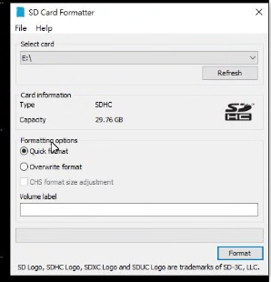
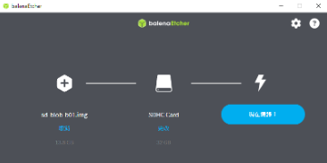
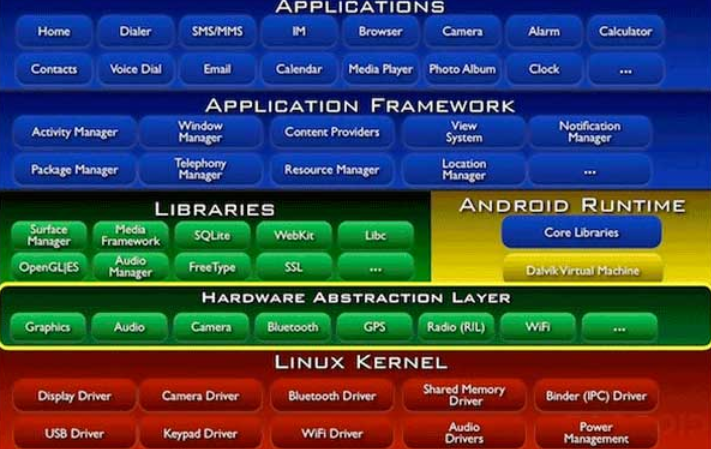
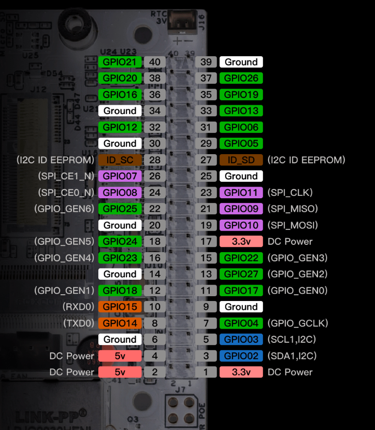
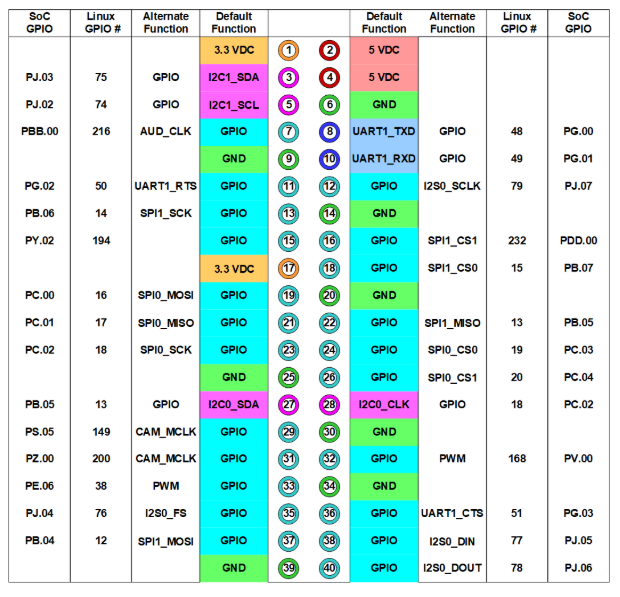
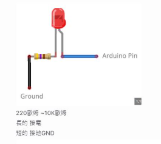
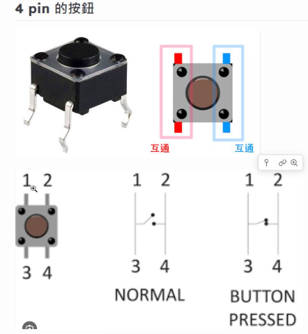
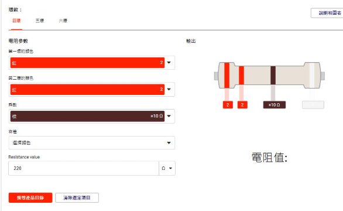
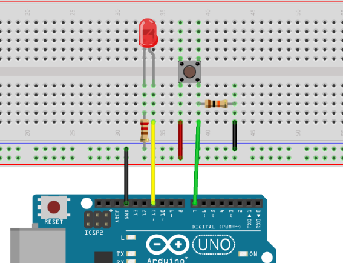
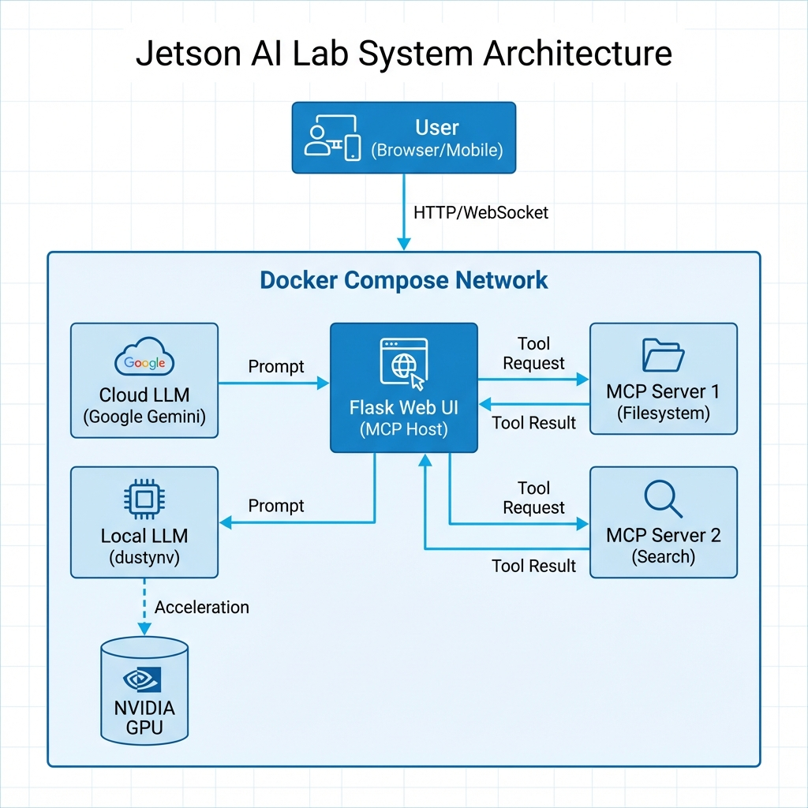

[info](https://drive.google.com/drive/folders/12ziUuyp-AXPtEMNotsjHQ_TJ5xlohHLQ)

[FPGA](https://drive.google.com/drive/folders/12ziUuyp-AXPtEMNotsjHQ_TJ5xlohHLQ)

## Nvidia Jetson Ecosystem
- Linux OS + 平行運算 + 容器化部署
- 挑戰在於「如何將 AI 模型高效地部署在邊緣端（Edge）並與硬體互動」
### HW
- 

### SW
這份內容非常有條理，非常適合整理成 Markdown 筆記格式。以下是轉換後的版本，增加了標題層級、粗體強調與表格，以提升閱讀體驗。

***

### 1. 核心基石：JetPack SDK (The Foundation)

這是所有 Jetson 開發的基礎。你可以把它想像成 Jetson 的「作業系統 + 驅動 + 加速庫」的大禮包

*   **OS (L4T - Linux for Tegra):** 基於 Ubuntu 的客製化 Linux 系統。這就是為什麼你會看到 Ubuntu 桌面環境。
*   **CUDA & cuDNN:** GPU 加速的核心。整合GPU, CPU, parallel compute and serial compute.
*   **TensorRT (關鍵):** 開發者必學。這是 NVIDIA 最強的推論（Inference）引擎。它負責將你訓練好的模型（來自 PyTorch/TensorFlow）進行「最佳化（Quantization, Layer Fusion）」，讓模型在 Jetson 上跑得飛快（FPS 提升數倍）。
*   **Multimedia API:** 硬體編解碼（Hardware Codec），處理 H.264/H.265 影片串流，減輕 CPU 負擔。

> **💡 開發者筆記：**
> 剛開始你會直接用 PyTorch 跑模型，但為了效能（Performance），最終你一定會需要學會如何將模型轉檔為 TensorRT engine (`.plan`)。

---

### 2. 機器人與自主移動：Isaac & ROS (The Brain & Body)

針對你提到的 FSD (Full Self-Driving 概念)、SLAM 和 ROS，這是目前的標準路徑：

*   **ROS / ROS 2 (Robot Operating System):** 機器人開發的通訊標準。Jetson 完美支援 ROS 2 (Humble/Foxy 等版本)。
*   **Docker 的角色：** 現在主流開發都建議直接在 Jetson 上跑 **ROS 2 Docker Container**，避免環境汙染。
*   **NVIDIA Isaac ROS (硬體加速版 ROS):** 這是 NVIDIA 推出的 ROS 2 軟體包（GEMs）。它將標準的 ROS 節點（Node）用 GPU 加速。

**應用場景：**
*   **vSLAM (Visual SLAM):** 使用 Isaac ROS Visual SLAM package，直接用 GPU 算位置。
*   **AprilTag:** 視覺標籤識別加速。
*   **NvBlox:** 建立 3D 避障地圖。

---

### 3. 智慧影像分析：DeepStream & Vision (The Eyes)

如果你要做「影像識別」、「監控 Server」或「多路影像分析」，光靠 OpenCV 是不夠的。

*   **DeepStream SDK:**
    *   **用途：** 專門處理多路（Multi-stream）影片分析的流水線（Pipeline）。
    *   **優勢：** 資料從 `攝影機` -> `解碼` -> `預處理` -> `AI 推論` -> `繪圖` -> `輸出`，全程都在 GPU 記憶體中完成 (**Zero Copy**)，CPU 幾乎不介入。
    *   **應用：** 智慧城市監控、工廠瑕疵檢測、車牌辨識 (LPR)。
*   **OpenCV (VPI - Vision Programming Interface):** Jetson 上有 VPI，這是 NVIDIA 版本的 OpenCV 加速庫，專門用來做傳統電腦視覺（邊緣檢測、縮放、變形）的 GPU 加速。

---

### 4. 快速上手與模型訓練 (The Workflow)

你提到的「20 個範例, 不到 20 行 CODE」通常是指 "Hello AI World" (Jetson Inference) 專案。

*   **Hello AI World (Jetson Inference):**
    *   這是最適合初學者的開源專案。
    *   內建 ImageNet (分類), DetectNet (物件偵測), SegNet (分割) 的範例。
    *   確實只需要極少的 Python code 就能跑起即時影像辨識。
*   **NVIDIA TAO Toolkit (Train - Adapt - Optimize):**
    *   如果你不想從零開始寫 AI 模型，可以使用 TAO。
    *   它提供預訓練模型（Pre-trained Models，如車牌辨識、人臉偵測），你只需要準備少量資料做 **Transfer Learning (遷移學習)** 即可。

---

### 總結：開發者技術地圖 (Tech Stack Summary)

為了達成你提到的應用，你的技術堆疊通常會長這樣：

| 層級 | 關鍵組件 | 開發者會碰到的事 |
| :--- | :--- | :--- |
| **Application** | FSD / SLAM / Server | 撰寫 Python/C++ 邏輯，整合感知數據。 |
| **Middleware** | Isaac ROS / DeepStream | 使用現成的 GPU 加速節點 (Node) 或 插件 (Plugin)。 |
| **Framework** | ROS 2 / Docker | 管理容器環境，處理節點間通訊。 |
| **Inference** | TensorRT | 將 `.pt` / `.onnx` 模型轉為 `.engine` 以獲得最高 FPS。 |
| **OS / Driver** | JetPack (L4T) | 刷機 (Flash OS)、監控 GPU 溫度與負載 (`jtop`)。 |


### Application
- server
- 影像識別
- FSD, SLAM

# Edge AI
- Edge device (SOM+AI model)
- Edge computing (arm5 mcu 單晶片+tf lite)
## edge device
- JAX/ TF/ Torch
- jeson, ubuntu
- tf lite
- python
## edge computing
- arm5 m5, m55, m6
- hal, 底層使用tf 使用hal 打包
- 

這是一張幫你徹底釐清 Jetson Nano 生態系的「分層地圖」。我們用 **「蓋房子」** 的概念來理解這一切。

簡單的結論先放在前面：
1.  **JetPack SDK** 是一個「大禮包」，它幫你把房子蓋好（OS）、水電接好（驅動）、工具備好（CUDA/TensorRT）。
2.  **Docker Image** 是一個「裝潢好的房間」，它包含家具（App）和工具（Libraries），但它必須蓋在地基（Kernel）上。

---

### Jetson Nano 架構分層圖 (The Stack)

請想像這是一個由下而上的 5 層結構。

#### 🏢 第 1 層：硬體 (Hardware)
*   **包含內容**：Jetson Nano 主機板、CPU (ARM)、GPU (Maxwell 架構)、記憶體。
*   **角色**：地基。所有的運算最終都是這裡的電路在跑。

#### 🏗️ 第 2 層：核心與驅動 (Kernel Space / Drivers) —— *Docker **不包含**這層！*
*   **關鍵字**：**L4T OS** (Linux for Tegra), **Kernel**, **Drivers** (BSP)
*   **說明**：
    *   這是 NVIDIA 修改過的 Ubuntu Linux 核心。
    *   這裡有最重要的 **GPU Driver**。
    *   **重點**：你的 Jetson Nano 刷機（燒錄 SD 卡）就是在裝這一層。如果這一層版本太舊 (JetPack 4.x)，上面想跑新的東西就會失敗。

#### 🔧 第 3 層：系統庫與加速器 (System Libraries / Middleware)
*   **關鍵字**：**CUDA Toolkit**, **cuDNN**, **TensorRT**
*   **角色**：翻譯官與加速器。
    *   **CUDA**：讓程式可以用 GPU 算數學。
    *   **cuDNN**：專門給深度學習用的數學公式庫（如卷積運算）。
    *   **TensorRT**：**推論引擎 (Inference Engine)**。它不是拿來訓練模型的，它是拿來「改裝」模型的。它會把你的 YOLO 模型簡化、合併計算步驟，讓它在 Nano 這種小車上跑得飛快。

#### 📦 第 4 層：應用框架 (Frameworks)
*   **關鍵字**：**PyTorch**, **TensorFlow**, **OpenCV**, **ROS**
*   **角色**：工具箱。
    *   開發者通常不在第 3 層寫 code (太難了)，而是用 PyTorch 呼叫 CUDA。
    *   **注意**：在 Docker 環境下，第 3 層和第 4 層通常都包在 Docker Image 裡面。

#### 📱 第 5 層：應用程式 (Application / App Layer)
*   **關鍵字**：**YOLOv5**, **Jupyter Lab**, **你的 Python Code**
*   **角色**：你實際在玩的東西。
    *   比如「偵測行人」、「車牌辨識」。

---

### 解答你的關鍵疑惑

#### Q1: JetPack SDK 到底是什麼？
**JetPack SDK = 第 2 層 + 第 3 層 ( + 一些 第 4 層的範例)**
它是一個「安裝包」。當你第一次用 SDK Manager 刷機時，它做了兩件事：
1.  把 **L4T OS (Linux 核心)** 燒進去。
2.  把 **CUDA, cuDNN, TensorRT** 這些庫安裝進去。

#### Q2: Docker Image 包含什麼？
**Docker Image = 第 3 層 (部分) + 第 4 層 + 第 5 層**
*   **不包含 Kernel**：它共用 Nano 本身的 Linux 核心。
*   **包含 OS 的「皮」**：它裡面有 Ubuntu 的檔案系統 (bin/bash, apt-get)，讓你覺得像是在操作一個 OS，但其實是假的，底層還是呼叫外面的核心。
*   **包含 CUDA Toolkit**：Docker 裡面會有 CUDA 的編譯器和函式庫，讓 PyTorch 能運作。

#### Q3: 這些東西分別跑在哪裡？

我把它們歸位：

| 你的關鍵字 | 所在層級 | 說明 |
| :--- | :--- | :--- |
| **Jetson Nano** | **HW** | 硬體板子 |
| **L4T OS** | **Kernel/OS** | 這是作業系統的核心，負責管硬體 |
| **GPU Driver** | **Kernel/OS** | 讓 OS 看得懂顯卡的驅動 |
| **CUDA / cuDNN** | **Libs (第3層)** | 這是中介軟體，Docker 裡面通常會自帶 |
| **TensorRT** | **Libs (第3層)** | **模型最佳化引擎**。它讀取模型 -> 轉成 TensorRT 格式 -> 丟給 GPU 跑 |
| **PyTorch** | **Framework (第4層)** | AI 開發框架，呼叫 CUDA 來計算 |
| **YOLO** | **App (第5層)** | 這是一套演算法/模型，跑在 PyTorch 之上 |

---

### 為什麼 Docker 在 Jetson 上這麼重要？(Eco-system 架構)

NVIDIA 的生態系黑科技在於 **「NVIDIA Container Runtime」**，它打通了第 2 層和第 3 層的牆壁。

**一般 Docker：**
`[ App + PyTorch ]`  <--隔離牆-->  `[ Host OS + GPU Driver ]`
*(結果：Docker 裡面看不到 GPU，跑不動 AI)*

**Jetson 的 Docker (NVIDIA Runtime)：**
`[ App + PyTorch + (動態掛載 CUDA Libs) ]`
        ⬇️ **打洞透傳 (Pass-through)** ⬇️
`[ Host OS + GPU Driver + Kernel ]`

### 總結給你的建議路徑

因為 JetPack (第2層) 已經固定在 4.6 版本了（Nano 不會再更新），你要做的事情是：

1.  **保持地基不變**：不要去亂動 Nano 的 Host OS 和 Driver。
2.  **變換裝潢 (Docker)**：
    *   想玩 YOLO？ -> 拉一個已經裝好 PyTorch + YOLO 的 Docker Image。
    *   想玩 ROS 機器人？ -> 拉一個 ROS 的 Docker Image。
    *   想玩 TensorRT 加速？ -> 拉一個 L4T-ML 的 Image，裡面已經幫你把 TensorRT 環境設好了。

這樣你就能理解，為什麼我說 **「GitHub 是拿來找 Code (第5層)，Docker 是拿來搞定環境 (第3-4層)」** 了吧！


# NVIDIA JetPack

## 概述
JetPack SDK = 作業系統 + 驅動 + 加速庫 (基於 Ubuntu OS)

## 核心組件

### 1. OS (L4T - Linux for Tegra)
- 基於 Ubuntu 的客製化 Linux 系統
- 這就是為什麼你會看到 Ubuntu 桌面環境

### 2. CUDA & cuDNN
- GPU 加速的核心
- 沒有它們,Jetson 就只是一塊普通的 ARM 板子

### 3. TensorRT ⭐ (關鍵)
- **開發者必學**
- NVIDIA 最強的推論 (Inference) 引擎
- 功能:
  - 將訓練好的模型 (來自 PyTorch/TensorFlow) 進行最佳化
  - 執行 Quantization、Layer Fusion 等優化技術
  - 讓模型在 Jetson 上跑得飛快 (FPS 提升數倍)

### 4. Multimedia API
- 硬體編解碼 (Hardware Codec)
- 處理 H.264/H.265 影片串流
- 減輕 CPU 負擔

### 5. 其他工具
- OpenCV, OpenALPR, OpenSTAMINA

## 開發者筆記
> 💡 剛開始你會直接用 PyTorch 跑模型,但為了效能 (Performance),最終你一定會需要學會如何將模型轉檔為 TensorRT engine (`.plan`)。

## 資源
- 20+ 個範例,不到 20 行 CODE
- [官方文件](https://developer.nvidia.com/embedded/jetpack)

# https://developer.nvidia.com/embedded/learn/get-started-jetson-nano-devkit#intro


## flash SOM IMAGE
- [ Jetson Nano Developer Kit SD Card Imagetext](https://developer.nvidia.com/embedded/learn/get-started-jetson-nano-devkit#write)

 
- format sd card for linux in linux

```bash
sudo dd if=sd-blob.img of=/dev/sda bs=4M status=progress conv=fsync
```
---


- [format sd card for linux in windows](https://www.sdcard.org/downloads/formatter/)





如何開始使用
https://developer.nvidia.com/embedded/learn/get-started-jetson-nano-devkit

安裝以下軟體
balenaEtcher-Setup-1.18.11
https://etcher.balena.io/#download-etcher



---
## boot SOM, and setup
- nano image 內建開發環境
- ssh remote control
- user config
- [ ] wifi config, install driver, setup correct kernel


## 遠端連線

###  client is ubuntu
- NoMachine 最佳
- xrdp 最方便
- IDE ssh 

### client is windows

- 找IP
```
ifconfig #ip addr
```

### 遠端連線 (Remote Connection) protocol

| 需求場景 | 推薦工具 (Best Choice) | 優點說明 |
| :--- | :--- | :--- |
| 連線管理 Linux 伺服器 | SSH | 最標準、安全且通用的遠端管理協議。 |
| 連線管理 🌟 Windows 首選 | RDP | 專為 Windows 設計，圖形界面傳輸速度最快。 |
| 連線管理  | VNC | 跨平台（Linux/Mac/Windows），但通常速度比 RDP 慢 |
| 傳送檔案給伺服器 | SFTP | 基於 SSH 加密，確保檔案傳輸過程安全性。 |
| 設定新路由器或硬體🌟 硬體工程師必用 | Serial | 透過實體序列埠連接，不需依賴網路環境即可設定。 |

### 遠端工具大比拼 (Tool Comparison)

| 特性 | MobaXterm (您的現狀) | VS Code (Remote SSH) | NoMachine | Termius |
| :--- | :--- | :--- | :--- | :--- |
| 主要用途 | 綜合工具箱 (SSH+SFTP+X11) | 程式開發 (Coding) | 遠端桌面 (GUI 操作) | 多裝置管理 / 監控 |
| X11 轉發 | 完美 (內建) | 需配合外部 X Server | 不適用 (它是整個桌面) | 不支援 |
| 檔案傳輸 | 方便 (左側拖拉) | 直覺 (直接編輯) | 較不方便 | 需付費版 |
| Jetson 資源消耗 | 低 | 中 (視外掛而定) | 中高 (視畫面複雜度) | 極低 |
| 推薦指數 | ⭐⭐⭐⭐⭐ (標準配備) | ⭐⭐⭐⭐⭐ (開發必備) | ⭐⭐⭐⭐ (圖形需求) | ⭐⭐⭐ (管理需求) |

## 環境設定
- install vlc多媒體撥放器
``` bash
sudo apt vlc
sudo apt-get  vlc
```

- install ffmpeg
``` bash
sudo apt install ffmpeg
```

- 中文輸入法
``` bash
sudo apt-get install ibus-pinyin ibus-chewing -y
sudo reboot
```

- 安裝python
``` bash
sudo apt-get update
sudo apt-get install python3-pip
```

- 監控HW

``` bash
sudo -H pip3 install -U jetson-stats
sudo reboot
jtop
```


## DEV langrage
- GCC(C++)
- python
- shell script

## 周邊設備
- driver需要支援linux
- keyboard , Wireless Mini USB Bluetooth CSR 4.0 Dual Mode Adapter Dongle

## 嵌入式硬體控制
- 環境設定完成後, 開始控制硬體
- GPIO, wifi, BT,ethernet, Serial Port/COM, Driver, Toolchain, Menuconfig

### Toolchain aka cross compiler on IDE
- 在電腦上編譯要在開發板跑的程式

### Menuconfig
- 設定 Linux Kernel 的功能（比如要不要支援某個特定的 WiFi 晶片）
- 寫image, jeston nano 4g image toolchain
### Driver
- 寫驅動程式讓作業系統認識硬體

## jetson nano hello world 
資料來源:
https://developer.nvidia.com/embedded/learn/getting-started-jetson


## AOSP (Android Open Source Project)



### 系統架構層級 (System Architecture)
- **JNI**: Java call C/C++
- **HAL**: Hardware Abstraction Layer
- **Kernel**: Linux Kernel

### 應用領域 (Application Domains)
- Car, Robot, Drone, Home Automation, Medical, Security, Transportation

### Jetson Nano & IoT OS 資源
- **Jetson Nano for Android TV**: [LineageOS Builds](https://download.lineageos.org/devices/porg/builds)
- **Raspberry Pi for Android Auto**: [Crankshaft](https://getcrankshaft.com/)
- **Jetson Nano 其他 OS (LibreELEC)**: [Forum Discussion](https://forum.libreelec.tv/thread/17950-nvidia-jetson-nano-support-any-chances-or-progress/)
- **Kodi Docker**: [Docker Hub](https://hub.docker.com/r/aliubimov/kodi-tegra)

### 機器人專案 (Robotics)
- **R1mini ROS2 SLAM**: [NVIDIA Projects](https://developer.nvidia.com/embedded/community/jetson-projects/omo_r1mini)

### Hello World AI (Jetson Inference)
- [Deploying Deep Learning](https://github.com/dusty-nv/jetson-inference#deploying-deep-learning)

### AI 演算法與準確率 (AI Algorithms & Accuracy)
> 參考數據庫: [MNIST Dataset](https://www.kaggle.com/datasets/hojjatk/mnist-dataset)

| 演算法 | 準確率 (Accuracy) | 備註 |
| :--- | :--- | :--- |
| **決策樹 (Decision Tree)** | 85% | 傳統機器學習 |
| **KNN** | 92% | |
| **DNN (NN / MLP)** | 95% | 深度神經網路 |
| **CNN** | 98% | 卷積神經網路 (影像首選) |

#### 進階視覺應用
- **YOLO**: 多物件偵測 (Object Detection)
- **Mask R-CNN**: 實例分割 (Instance Segmentation)

> **💡 訓練數據需求**: 一個分類最少需要 **1000張** 圖片。

---
## GPIO






### 查 Python 版本 和 pip
python3 --version
python --version
pip3 list

### GPIO

電子材料
https://hackmd.io/@PowenKo/B1e1MVaXel


37合一
https://hackmd.io/Qyz_Qw6BTL6LnQS0DpU-kA

---

02_DigitalOut_easy.py

pin14 > G > 短

GPIO18/pin12 > +  >長









---


03_DigitalInput_easy.py

03_DigitalInput_controlLed.py

---

#### PWM 可輸出類比訊號

**PWM 訊號具有三個關鍵參數：**

1. **頻率（Frequency）**
    - 每秒重複幾次脈波（單位：Hz）
    - 通常固定不變
    - 例：5HZ = 每秒重複5次脈波

2. **週期（Period）**
    - 一次完整 High + Low 的時間
    - 週期 = 1 / 頻率
    - 例：週期 = 1 / 5 = 0.2 秒

3. **佔空比（Duty Cycle）**
    - High 電位在一個週期中所佔的比例（%）
    - 例如：
        - 0%：永遠 Low
        - 50%：一半 High、一半 Low
        - 100%：永遠 High

---

## Docker
- 最聰明的玩法是「用 Docker 搞定環境，用 GitHub 取得程式碼
- [拜見Jetson God](https://github.com/dusty-nv/jetson-containers)
- keyWord:[l4t (Linux for Tegra), arm64]
- https://hackmd.io/@PowenKo/By_fzdj4xg

- Docker 是一種開源容器化平台，它使開發人員能夠將應用程式及其所有依賴項 (設定、檔案) 打包到一個標準化的單位中，稱為**容器（Container）**。
- 容器化技術確保應用程式能夠在任何環境中一致地執行，無論是開發、測試還是部署環境。

- 與虛擬機 (VM) 的主要差異為：Docker 容器共享 Host OS 核心，相當於把 OS 層抽離，因此更輕量。

### Docker 的基本組成

#### 1. Docker Engine
Docker 的核心技術，用於建立和管理容器。包含三部分：
- **Docker Daemon（服務端）**：負責處理容器的建立、執行、停止等操作。
- **Docker CLI（命令行工具）**：用於與 Docker Daemon 進行互動。
- **REST API**：提供給其他工具或應用程式使用的接口。

#### 2. Docker Image（映像檔）
容器的模板，包含應用程式及其運行所需的所有文件和依賴項。使用分層文件系統（Layered Filesystem），以節省存儲空間和下載時間。

**常用命令：**
- `docker images`：查看本地映像檔。
- `docker build`：從 Dockerfile 建立映像檔。
- `docker pull`：從 Docker Hub 拉取映像檔。

#### 3. Docker Container（容器）
映像檔的執行實例，每個容器都是相互隔離的。容器是輕量級的，啟動速度快。

**常用命令：**
- `docker run`：啟動容器。
- `docker ps`：查看正在運行的容器。
- `docker stop`：停止容器。

#### 4. Dockerfile
用於描述如何建立映像檔的文本文件。包含指令（例如 `FROM`、`RUN`、`COPY` 等），用於定義映像的環境。

#### 5. Docker Compose
定義和管理多容器應用程式的工具。使用 `docker-compose.yml` 文件定義應用程式的服務、網絡和卷。

#### 6. [Docker Hub](https://hub.docker.com/)
Docker 的雲端公共倉庫，用於存儲和分享映像檔。

### Docker run on Nano

install Docker on Jetson Nano 

```bash
sudo apt install -y docker.io
```

check Docker is installed successfully 
```bash
docker --version
```

將使用者加入 Docker 群組 若希望使用者執行 Docker 不需要 sudo，執行以下命令：

```bash
sudo usermod -aG docker $USER #nano
```
執行完成後，重新登入帳戶以生效。

啟動 Docker 服務

```bash
sudo systemctl start docker
sudo systemctl enable docker
```
### 在 Jetson Nano 上使用 Docker

#### run hello-Docker 
執行以下命令，下載並運行 Docker 測試容器：
```bash
docker run hello-world
```
如果 Docker 運作正常，會顯示 "Hello from Docker!" 的訊息。

#### CUDA run & test  using Docker.hub 現成image
NVIDIA 提供了支援 CUDA 的 Docker 映像檔以加速 AI 開發。

**確保 NVIDIA 驅動和 CUDA 可用：**
```bash
docker run --runtime nvidia --rm nvcr.io/nvidia/l4t-base:r32.6.1 nvidia-smi
```
- note
    - docker run: 如果本機有image, 會直接使用, 不會再pull, 反之會pull image
    - CUDA RUN success, 你可以找一個pytorch image, 來體驗


接下來玩個經典案例
```
用 Docker Compose 跑一個 Jupyter Notebook 環境，而且是帶有 CUDA PyTorch GPU 加速的
```

#### install Docker Compose
```bash
pip3 install docker-compose
```

```bash
docker-compose --version
```
---
### ollama run on Nano
可惜RAM不夠

### Flask + GEMINI API run on Nano (Implemented)


目前已在 Jetson Nano 上成功部署 Flask 應用程式，並透過 Docker 容器化解決 Python 版本相容性問題，整合 Google Gemini API 作為推理核心。

**架構細節：**
1.  **Host (Jetson Nano)**:
    - 運行 Docker Engine。
    - 透過 `docker-compose` 管理服務。

2.  **Container: `app-core` (Flask API)**:
    - **Base Image**: `python:3.10-slim` (繞過 Nano 原生 Python 3.6 限制)。
    - **Web Server**: Flask (Port 5000)，提供 HTTP API 與簡易 Web UI。
    - **LLM Client**:
        - 整合 Google Generative AI SDK。
        - 模型版本：`gemini-2.5-flash` (高效率版本)。
        - 備援機制：預設優先使用 Gemini Cloud API。
    - **MCP Manager**: 包含 Model Context Protocol 客戶端，可連接 `mcp-fs` 進行檔案操作。

3.  **Container: `mcp-fs` (MCP Server)**:
    - 運行基於 `mcp` library 的檔案系統工具服務 (Port 8000)。
    - 允許 LLM 透過工具讀取/列出目錄 (目前已驗證連線)。

**已驗證功能：**
- [x] **API Endpoint**: `POST /api/chat` 可正常接收 JSON 請求並回傳 Gemini 生成內容。
- [x] **Health Check**: `GET /health` 回傳服務狀態及已載入的 MCP 工具列表。
- [x] **跨裝置存取**: 可從區域網路內的其他電腦 (PC) 呼叫 Nano 上的 API。
- [x] **環境變數管理**: 使用 `.env` 檔案安全管理 `GEMINI_API_KEY`。
---
### ROS Humble on NANO

the boby
ROS 專業路徑：Waveshare JetBot / Yahboom 系列
特點：市售現成品，通常帶有雷達 (Lidar) 或深度相機。
適合：想玩 SLAM (建圖) 和 Navigation (導航) 的人。

the brain
路線 B：ROS 2 (Robot Operating System) —— 進階工程師必修
如果你想學的是產業界的自駕技術（建圖、路徑規劃），必須學 ROS。
挑戰：Nano 原生系統只支援舊版 ROS 1 (Melodic)。
解法 (Docker)：這就是你的強項！ 請使用 dusty-nv/ros:humble-desktop-l4t-r32.7.1。
透過 Docker 在 Nano 上跑 ROS 2 Humble (較新版本)。
利用 ROS 2 的 Node 通訊機制，將你的 Gemini 服務包裝成一個 ROS Node。

VLM
Flash+gemini

第一步實作：
不要急著讓它跑。先將你的 Flask + Gemini 接上 USB WebCam。
抱著 Nano (或放在手推車上) 移動，測試 Gemini 能否即時描述它看到的環境 (例如每 5 秒分析一次)。
這驗證了「視覺語言導航」的可行性，之後再加上輪子。

---


NVIDIA DeepStream SDK: 同時處理 8 路以上的 1080p 影片，做高效能的人/車/物檢測
---
已經架設好 Docker + Flask + Gemini API），以及 Jetson Nano 的硬體特性, 「給你的 AI 裝上眼睛」 開始


---
### 🚀 Project: Jetson AI Lab (Local LLM + MCP Architecture)

這是一個進階的 Edge AI 專案，目標是在 Jetson Nano 上建立一個擁有「工具使用能力 (Tool Use)」的 AI 助理。

**核心挑戰：** Jetson Nano 資源有限 (4GB RAM)，必須精打細算。

##### 1. 架構設計 (Architecture First)
回答您的問題：**先長架構 (Architecture)，再寫 Compose。** 沒有架構圖，Compose 只是瞎拼湊。

我們採用 **"MCP Host Pattern"** 架構：

**關鍵概念釐清：**
> ❓ **疑問**：Gemini 或 Local LLM (dustynv) 沒辦法直接 Call MCP Server 對吧？

> ✅ **正解**：沒錯！LLM 只是「大腦」，它只會輸出文字（例如："請幫我呼叫查詢天氣的工具"）。**需要一個「手腳」來幫它執行這些動作，這個角色就是 MCP Client (通常內建在 Host App 裡)**。

> ✅ **note**：
    - LLM 只會輸出文字，它不知道要怎麼做
    - MCP Client 會幫host尋找最佳的 MCP Server完成任務
    


**系統架構圖 (System Architecture):**




**元件職責：**
1.  **Flask Web UI (核心控制塔 / MCP Host)**: 這是您要開發的 Python 核心應用。
    *   **角色**：它是大腦 (LLM) 與手腳 (MCP Servers) 之間的橋樑。
    *   **核心功能**：
        *   **使用者介面**：接收指令 (Text/Voice)。
        *   **LLM 串接**：將指令發送給 Gemini 或 Local LLM, 有網路時使用 Gemini, 沒網路時使用 Local LLM。
        *   **Agentic Workflow (代理人工作流)**：這是最關鍵的部分。它內建 **MCP Client**，能讓 LLM 進行多步驟推理與行動。
    *   **實際場景範例 (當使用者說：「Let's get moving. 開始本日行程」)**：
        *   *Step 1 (資訊蒐集)*：LLM 判斷需要資訊，Host 透過 MCP Client 同時呼叫 **Calendar Server** (查行程) 與 **Weather Server** (查天氣)。
        *   *Step 2 (決策推理)*：LLM 根據「下雨」與「正式會議」，建議穿著並決定交通方式。
        *   *Step 3 (採取行動)*：LLM 發出指令，Host 透過 MCP Client 呼叫 **Robot Control Server** (去衣櫃取外套)。
        *   *Step 4 (回報)*：Host 整合所有結果，回覆使用者「已幫您準備好外套並叫好車了」。
2.  **Local LLM Service (離線大腦)**: 這是您的「地端推論引擎」。
    *   **來源**: 我們不使用標準 Docker Image，而是使用 **`dustynv/jetson-containers`**。
        *   這是 NVIDIA 工程師 (Dusty NV) 專為 Jetson 優化的專案，解決了許多 ARM64 架構與 CUDA 版本相容性的地獄問題。
    *   **推薦容器**:
        *   **`ollama`**: 目前最輕量好用的選擇，支援標準 API，適合 Nano 這種資源受限的板子。
        *   **`l4t-text-generation` (Oobabooga)**: 功能強大的 WebUI，支援更多微調與外掛，但較吃資源。
    *   **職責**: 專注於 **"Text-in, Text-out"**。它不負責聯網或操作GPIO，只負責在沒網路時，用 GPU 幫您生成文字回應。
3.  **MCP Servers**: 獨立的 Docker 容器，負責實際髒活 (讀檔、爬蟲、GPIO 控制)。

##### 2. 實作順序 (Implementation Roadmap)

建議依照以下順序開發，避免陷入 Dependency Hell：

*   **Phase 1: 基礎環境 (Infrastructure)**
    *   安裝 Docker & Docker Compose (您已完成)。
    *   拉取 `dustynv` 的優化版 Image 測試 Local LLM 是否跑得動 (Nano 跑 Llama-3-8B 會很吃力，跑 Phi-3 或 Qwen-2-0.5B/1.5B 等小模型)。

*   **Phase 2: "大腦" 連線 (LLM Integration)**
    *   寫一個簡單的 Python Script，能切換呼叫 Gemini API (雲端) 和 Local LLM API (地端)。

*   **Phase 3: "手腳" 實作 (MCP Client)**
    *   在 Python Script 中加入 MCP Client 功能 (可以使用官方 Python SDK)。
    *   架設一個簡單的 MCP Server (例如 `filesystem-server`) 測試連線。

*   **Phase 4: 整合與部署 (Orchestration)**
    *   撰寫 `docker-compose.yml` 把 Flask, Local LLM, MCP Server 全部串起來。
    *   (進階) 設定 CI/CD Pipeline 自動建置 ARM64 Image。

##### 3. Docker Compose 範例規劃 (Draft)

```yaml
version: '3.8'
services:
  # 1. 核心應用 (MCP Host + Web UI)
  app-core:
    build: ./app_flask
    ports:
      - "5000:5000"
    environment:
      - GEMINI_API_KEY=${GEMINI_KEY}
      - LOCAL_LLM_URL=http://local-llm:8080
    volumes:
      - ./app_data:/data
    depends_on:
      - local-llm
      - mcp-fs

  # 2. 地端 LLM (使用 NVIDIA 優化版容器)
  local-llm:
    image: dustynv/text-generation-webui:r36.2.0
    runtime: nvidia  # 關鍵：啟用 GPU
    ports:
      - "8080:7860"  # Web UI port
      - "5000:5000"  # API port
    volumes:
      - ./models:/data/models

  # 3. 工具伺服器 (MCP Server)
  mcp-fs:
    image: mcp/filesystem-server
    volumes:
      - /home/user:/host_files  # 開放特定目錄給 AI 讀取
```


**note
使用DOCKER缺點: Docker 服務會自動啟動, ( 可以kill掉)

```bash
sudo docker kill <container_id>
```

啟動服務：
```bash
docker-compose up
```

---
### Docker pop Application

- YOLO
- MCP Server


---
### Docker 常用指令（簡介）

| 功能 | 指令範例 |
| :--- | :--- |
| 查看版本 | `docker --version` |
| 查看容器 | `docker ps -a` | process status
| 停止容器 | `docker stop <容器名稱或 ID>` |
| 移除容器 | `docker rm <容器名稱或 ID>` |
| 查看映像檔 | `docker images` |
| 刪除映像檔 | `docker rmi <映像名稱或 ID>` |
| 執行容器 | `docker run -d -p 8080:80 nginx` |

### Docker 指令參數詳細解讀 (Flags Explained)

| 縮寫 | 完整名稱 (Full Name) | 意義 (Meaning) | 範例數值解釋 |
| :--- | :--- | :--- | :--- |
| **`-a`** | `--all` | 全部 (含已停止的容器) | `docker ps -a` |
| **`-d`** | `--detach` | 背景執行 (Detach mode)<br>啟動後不佔用當前終端機。 | `docker run -d ...` |
| **`-p`** | `--publish` | 端口映射 (Port Mapping)<br>打通內外網路通道。 | `-p 8080:80`<br>**8080**: 本機電腦 (Host) 的 Port<br>**80**: 容器內部 (Container) 的 Port |
| **`-i`** | `--interactive` | 互動模式<br>保持標準輸入 (Stdin) 開啟。 | 常用於須輸入指令時 |
| **`-t`** | `--tty` | 終端機 (Pseudo-TTY)<br>模擬終端機顯示格式。 | 讓輸出畫面正常顯示 |
| **`-it`**| N/A | (組合技) 進入容器互動模式 | `docker exec -it <名稱> /bin/bash` |

## Jetson vs Pixhawk 架構比較

| 特性 | Jetson | Pixhawk |
| :--- | :--- | :--- |
| **核心類型** | Linux 作業系統 | MCU (不是作業系統, 單一程式循環) |
| **應用層級** | 軟體、資料庫、儀錶板 | 韌體控制、感測器讀取 |
| **AI 能力** | AI (LLM, TensorFlow) | Edge AI (TensorFlow Lite for Microcontroller) |
| **開發語言** | Python, C, C++, Java... | C, Arduino |
| **硬體介面** | 感應器讀取 / GPIO | 感應器讀取 / GPIO |
| **通訊連結** | USB, BT, Wifi | USB, BT, Wifi |


jetson nano,  Docker

https://hackmd.io/@PowenKo/r1GQOXJSbg

https://blog.jmaker.com.tw/arduino-tutorials/


 jetson 
 pixhawk
OS
 MCU
 Linux作業系統  
軟體
資料庫
儀錶板
不是作業系統, 一次只能跑一個code
AI (LLM, tensorflow)
AI edge邊緣運算
 (tensorflow Lite for microcontroller)
Python, C, C++, Java….
C, Arduino
感應器讀取
感應器讀取
GPIO
GPIO
USB,BT, Wifi
USB,BT, Wifi

AI edge邊緣運算
 (tensorflow Lite for microcontroller)

Python  + C


AI 流程

資料收集 (C/Python)
訓練 (Python)
AI 預測 (C/Python)

https://www.tensorflow.org/lite/microcontrollers?hl=zh-tw

 


## jetson containers
[dusty-nv/jetson-containers](https://github.com/dusty-nv/jetson-containers)

### Getting Started

```
# install the container tools
git clone https://github.com/dusty-nv/jetson-containers
bash jetson-containers/install.sh

# automatically pull & run any container
jetson-containers run $(autotag l4t-pytorch)
```


## GPIO

## CAR

[L298N](https://hackmd.io/@PowenKo/r13vVVJHZl)

servo motor 應用於AMR, 
Stepper motor

L298N直流馬達驅動板 
---
### 04_B_L298N.py


## Ollama
https://ollama.com/


## Jetson SDK(Software Development Kit), JetPack
AI圖片影像分類, detection, segmentation

Nvidia JetPack, Metropolis,Isaac,AI高效能計算機器人(HPC) Holoscan


8.9. 啟動容器 docker 由於容器運行需要的掛載和設備多種多樣，推薦使用 docker/run.sh 腳本來運行容器：

```bash
cd ~/Desktop 
git clone --recursive https://github.com/dusty-nv/jetson-inference 
cd jetson-inference 
docker/run.sh
```

### Jetson Inference 深度學習推論庫

- https://github.com/dusty-nv/jetson-inference
`jetson-inference` 是一個專為 Jetson 系列設計的即時深度學習推論 (Inference) 範例庫，使用了 NVIDIA TensorRT 來加速。

#### 支援的深度學習框架 (Frameworks)
這些框架通常用於 **訓練 (Training)** 模型，訓練好的模型再轉由 JetPack/TensorRT 在 Nano 上進行 **推論 (Inference)**。
- **TensorFlow**
- **PyTorch**

#### 常用 AI 模型 (AI Models)
`jetson-inference` 內建支援多種預訓練模型，可直接下載使用：
- **GoogleNet**: 經典的圖像分類模型，準確率與效能平衡佳。
- **ResNet-18**: 輕量級的殘差網路，非常適合 Jetson Nano 進行即時 (Real-time) 影像辨識。

**應用場景：**
1. **影像分類 (ImageNet)**: 辨識畫面中是「什麼物體」 (例如：狗、貓、車)。
2. **物件偵測 (DetectNet)**: 找出物體在畫面中的「位置」並框選出來 (例如：行人偵測)。
3. **語意分割 (SegNet)**: 將畫面中的每個像素進行分類 (例如：區分道路、人行道、天空)。

### 實戰：使用 USB Webcam 進行即時影像辨識
在成功執行 `docker/run.sh` 進入容器後，您可以直接使用 USB 攝影機進行推論。

#### 步驟 1: 確認攝影機裝置
請先確認您的 USB 攝影機已連接，並在終端機查看裝置代號：
```bash
ls /dev/video*
# 通常是 /dev/video0 或 /dev/video1
```

#### 步驟 2: 執行影像識別 (Classification)
使用 `imagenet.py` 來辨識畫面中央的物體。
```bash
# 假設您的攝影機是 /dev/video0
./imagenet.py /dev/video0 webrtc://@:8554/output
```
host search 

```
http://192.168.55.1:8554
```

#### 步驟 3: 執行物件偵測 (Detection)
使用 `detectnet.py` 來框出畫面中的人、車等物件。
```bash
# 這是最直觀的「影像辨識」體驗
./detectnet.py /dev/video0 webrtc://@:8554/output
```

host search 

```
http://192.168.55.1:8554
```

> **小技巧**：如果是使用 CSI 介面的 Raspberry Pi Camera，則將 `/dev/video0` 替換為 `csi://0` 即可。


### 串流技術大比拼：WebRTC (Web) vs RTSP (VLC)

在 Jetson Nano 做遠端推論時，把畫面傳回電腦有兩種主流方式，以下是詳細比較：

| 特性 | **WebRTC (網頁瀏覽器)** | **RTSP (VLC 播放器)** |
| :--- | :--- | :--- |
| **延遲 (Latency)** | **極低 (Low Latency)** <br> 通常 < 0.5 秒，最適合即時監控。 | **較高 (High Latency)** <br> 通常 2~5 秒 (VLC 預設會緩衝)，不適合即時互動。 |
| **操作便利性** | **⭐⭐⭐⭐⭐ (免安裝)** <br> 用 Chrome/Edge 打開網址即可觀看。 | **⭐⭐⭐ (需安裝軟體)** <br> 電腦端需要安裝 VLC Player 或 PotPlayer。 |
| **相容性** | 瀏覽器**擋廣告/自動播放**有時會導致黑屏，需手動點 Play。 | 支援度極高，只要連上手就能播，不易斷線。 |
| **區網穿透** | 依賴 STUN/TURN，跨網段 (例如公司防火牆) 設定較麻煩。 | 較容易穿透防火牆，標準工業監控協議。 |
| **多裝置支援** | 手機、平板、電腦通殺。 | 手機端也需下載 VLC App 才能看。 |

#### 🎯 結論建議
*   **開發除錯時 (您現在)**：選 **WebRTC**。因為您需要「馬上」看到結果，不希望做了動作 3 秒後畫面才動。
*   **長期監控/錄影時**：選 **RTSP**。如果您是把 Nano 放在無人機或攝影機上做 24 小時監控，RTSP 比較穩定，且 VLC 可以輕鬆錄影存檔。

#### 💡 如何使用 RTSP?
若您想體驗 webrtc，請改用以下指令：
```bash
./detectnet.py /dev/video0 webrtc://@:8554/output
```
Chrome/Edge 瀏覽器，輸入： http://192.168.55.1:8554

> **⚠️ 注意**：**RTSP 無法直接在 Chrome/Edge 網頁上開啟**。
> 如果您堅持要用「瀏覽器」看畫面，請回到上一步使用 `webrtc://` 協定。


### 無人機圖傳方案解析 (Drone Video Transmission)

在無人機領域 (Drone / UAV)，影像傳輸方式取決於您的用途：

| 方案 | 通訊協定 | 延遲 (Latency) | 應用場景 | Jetson Nano 整合方式 |
| :--- | :--- | :--- | :--- | :--- |
| **QGroundControl (標準)** | **RTSP** | 中 (200~500ms) | **工業巡檢、航拍監控** | 地面站軟體 (QGC/Mission Planner) **原生支援 RTSP**。Jetson 若跑 `rtsp://`，QGC 可直接顯示畫面。 |
| **DIY 數位圖傳 (極速)** | **GStreamer UDP** | 低 (50~150ms) | **FPV 飛行、精細操控** | 不走 RTSP 握手過程，直接丟 H.264 封包。適合自製程式接收。 |
| **5G/4G 雲端操控** | **WebRTC** | 低 (100~300ms) | **超視距飛行 (BVLOS)** | 利用 4G Dongle 通過網際網路傳輸，就是您目前用的這套。 |
| **穿越機 (Racing)** | 類比 5.8G | 趨近 0 | **競速** | (不經過 Jetson，獨立鏡頭) |

#### 🚀 結論：無人機通常怎麼做？
如果是像 Jetson Nano 這種 **Companion Computer (伴飛電腦)** 架構：
1.  通常使用 **RTSP**。
2.  因為開源地面站軟體 **QGroundControl (QGC)** 的設定頁面裡，有一個 "Video Source" 選項，選 RTSP 並輸入 IP 就可以把 AI 畫面整合在儀表板裡了。

#### 💡 技術小教室：RTSP vs UDP
使用者常問：「RTSP 是不是用 UDP？」
*   **答案是 YES**。
*   **RTSP (Real Time Streaming Protocol)** 其實只是一個「遙控器」，負責告訴伺服器「開始播放」、「暫停」、「設定解析度」。
*   **真的在傳送影像資料 (Video Data)** 時，底層通常是走 **RTP over UDP**。
    *   **UDP (User Datagram Protocol)**：只管丟封包，不管你有沒有收到。這對無人機很重要，因為就算掉格也比畫面延遲好 (Low Latency)。
    *   **VLC vs QGC**：這兩者都只是「接收端 (Client)」。VLC 是一個通用的播放器，而 QGC 是一個專門設計來疊加飛行數據 (OSD) 的播放器。底層收的都是同一條 RTSP (UDP) 串流。


