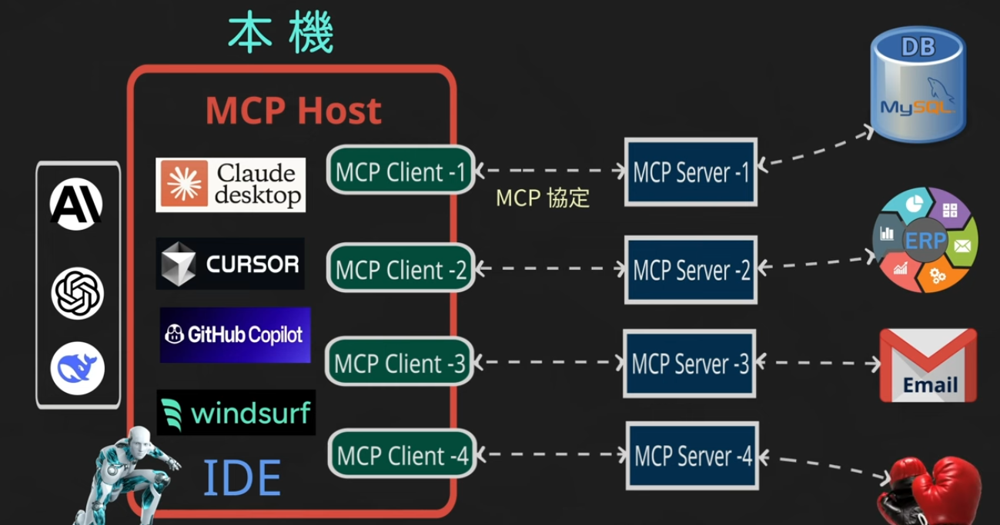
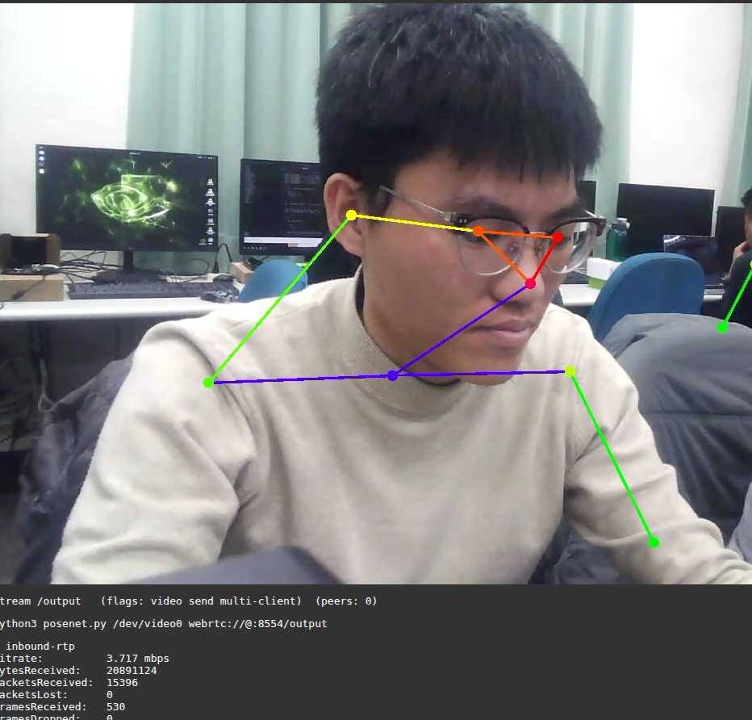
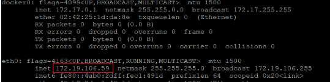
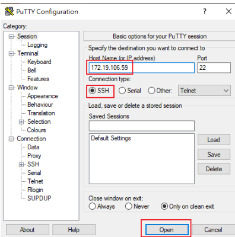
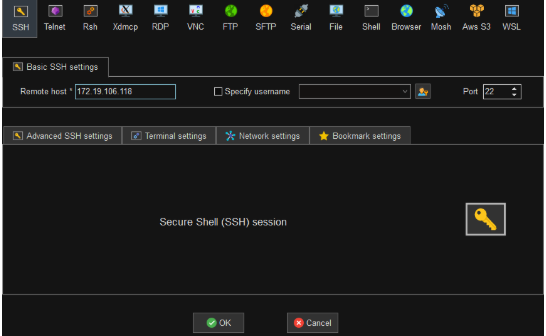
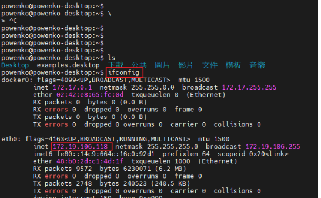
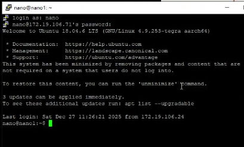
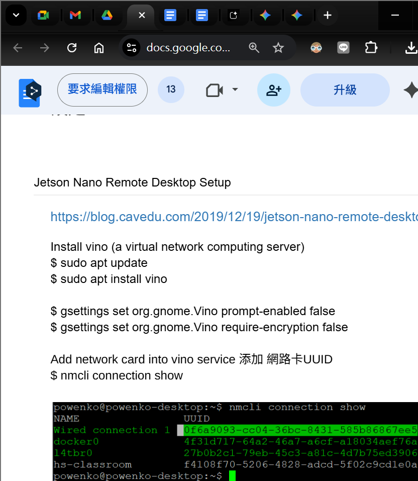
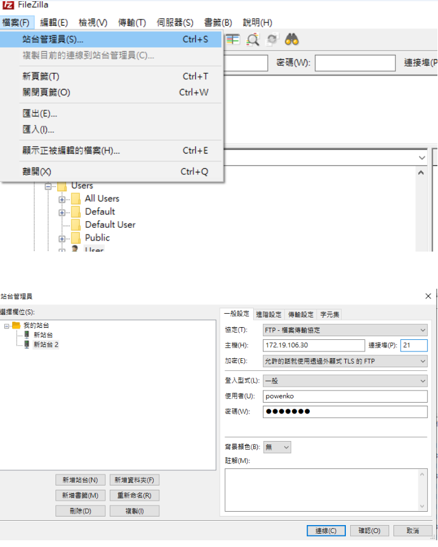
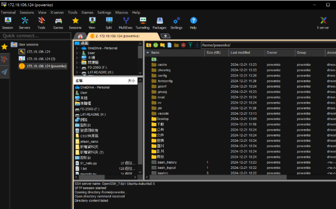

[info](https://drive.google.com/drive/folders/12ziUuyp-AXPtEMNotsjHQ_TJ5xlohHLQ)

[FPGA](https://drive.google.com/drive/folders/12ziUuyp-AXPtEMNotsjHQ_TJ5xlohHLQ)

## Nvidia Jetson Ecosystem
- Linux OS + 平行運算 + 容器化部署
- 挑戰在於「如何將 AI 模型高效地部署在邊緣端（Edge）並與硬體互動」
### HW
- 

### SW
這份內容非常有條理，非常適合整理成 Markdown 筆記格式。以下是轉換後的版本，增加了標題層級、粗體強調與表格，以提升閱讀體驗。

***

### 1. 核心基石：JetPack SDK (The Foundation)

這是所有 Jetson 開發的基礎。你可以把它想像成 Jetson 的「作業系統 + 驅動 + 加速庫」的大禮包

*   **OS (L4T - Linux for Tegra):** 基於 Ubuntu 的客製化 Linux 系統。這就是為什麼你會看到 Ubuntu 桌面環境。
*   **CUDA & cuDNN:** GPU 加速的核心。整合GPU, CPU, parallel compute and serial compute.
*   **TensorRT (關鍵):** 開發者必學。這是 NVIDIA 最強的推論（Inference）引擎。它負責將你訓練好的模型（來自 PyTorch/TensorFlow）進行「最佳化（Quantization, Layer Fusion）」，讓模型在 Jetson 上跑得飛快（FPS 提升數倍）。
*   **Multimedia API:** 硬體編解碼（Hardware Codec），處理 H.264/H.265 影片串流，減輕 CPU 負擔。

> **💡 開發者筆記：**
> 剛開始你會直接用 PyTorch 跑模型，但為了效能（Performance），最終你一定會需要學會如何將模型轉檔為 TensorRT engine (`.plan`)。

---

### 2. 機器人與自主移動：Isaac & ROS (The Brain & Body)

針對你提到的 FSD (Full Self-Driving 概念)、SLAM 和 ROS，這是目前的標準路徑：

*   **ROS / ROS 2 (Robot Operating System):** 機器人開發的通訊標準。Jetson 完美支援 ROS 2 (Humble/Foxy 等版本)。
*   **Docker 的角色：** 現在主流開發都建議直接在 Jetson 上跑 **ROS 2 Docker Container**，避免環境汙染。
*   **NVIDIA Isaac ROS (硬體加速版 ROS):** 這是 NVIDIA 推出的 ROS 2 軟體包（GEMs）。它將標準的 ROS 節點（Node）用 GPU 加速。

**應用場景：**
*   **vSLAM (Visual SLAM):** 使用 Isaac ROS Visual SLAM package，直接用 GPU 算位置。
*   **AprilTag:** 視覺標籤識別加速。
*   **NvBlox:** 建立 3D 避障地圖。

---

### 3. 智慧影像分析：DeepStream & Vision (The Eyes)

如果你要做「影像識別」、「監控 Server」或「多路影像分析」，光靠 OpenCV 是不夠的。

*   **DeepStream SDK:**
    *   **用途：** 專門處理多路（Multi-stream）影片分析的流水線（Pipeline）。
    *   **優勢：** 資料從 `攝影機` -> `解碼` -> `預處理` -> `AI 推論` -> `繪圖` -> `輸出`，全程都在 GPU 記憶體中完成 (**Zero Copy**)，CPU 幾乎不介入。
    *   **應用：** 智慧城市監控、工廠瑕疵檢測、車牌辨識 (LPR)。
*   **OpenCV (VPI - Vision Programming Interface):** Jetson 上有 VPI，這是 NVIDIA 版本的 OpenCV 加速庫，專門用來做傳統電腦視覺（邊緣檢測、縮放、變形）的 GPU 加速。

---

### 4. 快速上手與模型訓練 (The Workflow)

你提到的「20 個範例, 不到 20 行 CODE」通常是指 "Hello AI World" (Jetson Inference) 專案。

*   **Hello AI World (Jetson Inference):**
    *   這是最適合初學者的開源專案。
    *   內建 ImageNet (分類), DetectNet (物件偵測), SegNet (分割) 的範例。
    *   確實只需要極少的 Python code 就能跑起即時影像辨識。
*   **NVIDIA TAO Toolkit (Train - Adapt - Optimize):**
    *   如果你不想從零開始寫 AI 模型，可以使用 TAO。
    *   它提供預訓練模型（Pre-trained Models，如車牌辨識、人臉偵測），你只需要準備少量資料做 **Transfer Learning (遷移學習)** 即可。

---

### 總結：開發者技術地圖 (Tech Stack Summary)

為了達成你提到的應用，你的技術堆疊通常會長這樣：

| 層級 | 關鍵組件 | 開發者會碰到的事 |
| :--- | :--- | :--- |
| **Application** | FSD / SLAM / Server | 撰寫 Python/C++ 邏輯，整合感知數據。 |
| **Middleware** | Isaac ROS / DeepStream | 使用現成的 GPU 加速節點 (Node) 或 插件 (Plugin)。 |
| **Framework** | ROS 2 / Docker | 管理容器環境，處理節點間通訊。 |
| **Inference** | TensorRT | 將 `.pt` / `.onnx` 模型轉為 `.engine` 以獲得最高 FPS。 |
| **OS / Driver** | JetPack (L4T) | 刷機 (Flash OS)、監控 GPU 溫度與負載 (`jtop`)。 |


### Application
- server
- 影像識別
- FSD, SLAM

# Edge AI
- Edge device (SOM+AI model)
- Edge computing (arm5 mcu 單晶片+tf lite)
## edge device
- JAX/ TF/ Torch
- jeson, ubuntu
- tf lite
- python
## edge computing
- arm5 m5, m55, m6
- hal, 底層使用tf 使用hal 打包
- 

# NVIDIA JetPack

## 概述
JetPack SDK = 作業系統 + 驅動 + 加速庫 (基於 Ubuntu OS)

## 核心組件

### 1. OS (L4T - Linux for Tegra)
- 基於 Ubuntu 的客製化 Linux 系統
- 這就是為什麼你會看到 Ubuntu 桌面環境

### 2. CUDA & cuDNN
- GPU 加速的核心
- 沒有它們,Jetson 就只是一塊普通的 ARM 板子

### 3. TensorRT ⭐ (關鍵)
- **開發者必學**
- NVIDIA 最強的推論 (Inference) 引擎
- 功能:
  - 將訓練好的模型 (來自 PyTorch/TensorFlow) 進行最佳化
  - 執行 Quantization、Layer Fusion 等優化技術
  - 讓模型在 Jetson 上跑得飛快 (FPS 提升數倍)

### 4. Multimedia API
- 硬體編解碼 (Hardware Codec)
- 處理 H.264/H.265 影片串流
- 減輕 CPU 負擔

### 5. 其他工具
- OpenCV, OpenALPR, OpenSTAMINA

## 開發者筆記
> 💡 剛開始你會直接用 PyTorch 跑模型,但為了效能 (Performance),最終你一定會需要學會如何將模型轉檔為 TensorRT engine (`.plan`)。

## 資源
- 20+ 個範例,不到 20 行 CODE
- [官方文件](https://developer.nvidia.com/embedded/jetpack)

# https://developer.nvidia.com/embedded/learn/get-started-jetson-nano-devkit#intro


## flash SOM IMAGE
- [ Jetson Nano Developer Kit SD Card Imagetext](https://developer.nvidia.com/embedded/learn/get-started-jetson-nano-devkit#write)

 
- [format sd card for linux in windows](https://www.sdcard.org/downloads/formatter/)

- [format sd card for linux in linux](https://www.sdcard.org/downloads/sd-memory-card-formatter-for-linux/)




如何開始使用
https://developer.nvidia.com/embedded/learn/get-started-jetson-nano-devkit

安裝以下軟體
balenaEtcher-Setup-1.18.11
https://etcher.balena.io/#download-etcher




## boot SOM
- nano image 內建開發環境

## 遠端連線
### putty com port ssh
- 可多用戶同時連線
- IPXXX, port 22

ifconfig





### mobaXterm com port ssh







### 設定VNC Jetson Nano Remote Desktop Setup

- Install vino (a virtual network computing server)
sudo apt update
sudo apt install vino

gsettings set org.gnome.Vino prompt-enabled false
gsettings set org.gnome.Vino require-encryption false

- Add network card into vino service 添加 網路卡UUID 

nmcli connection show



- 設定GONE 螢幕分享給使用者UUID
dconf write /org/gnome/settings-daemon/plugins/sharing/vino-server/enabled-connections "['0f6a9093-cc04-36bc-8431-585b86867ee5']" export DISPLAY=:0

- 設定開機啟動vino server
$ cd ~/.config
$ mkdir autostart 
$ cd autostart

$ sudo nano ~/.config/autostart/vino-server.desktop

- 添加以下的文字:
[Desktop Entry]
Type=Application
Exec=/usr/lib/vino/vino-server
Name=Vino VNC Sharing
X-GNOME-Autostart-enabled=true
NoDisplay=false

- Save file and return to shell    按下ctrl+O 存   ctrl+x 離開

- 編輯另外一個檔案
$ sudo nano /etc/X11/xorg.conf

添加以下文字:
Section "Screen"
    Identifier  "Default Screen"
    Monitor     "Configured Monitor"
    Device      "Default Device"
    SubSection  "Display"
        Depth 24
        Virtual 1200 1080
    EndSubSection
EndSection

- Save file and return to shell    按下ctrl+O 存   ctrl+x 離開

- Install tightvncserver and xrdp
$ sudo apt-get install tightvncserver xrdp  -y
$ sudo reboot

- Install xfce4 (a desktop environment)
- 一個輕量級的桌面環境 (XFCE)，並設定讓 Windows 的「遠端桌面連線 (RDP)」使用這個環境登入。
- 主要目的是 「解決 RDP 連線後的桌面黑屏或效能問題」
```
sudo apt-get install xfce4 -y
echo xfce4-session >~/.xsession
sudo service xrdp restart
sudo reboot
```

- 找IP
$ ifconfig

Windows 可以用以下的方法連線
1. Windows 10 remote desktop connection
Open ‘Remote Desktop Connection’ app
IP: 192.168.1.42
Use Xorg for log in session


2. 也可以用RealVNC Viewer 連線

### 遠端連線 (Remote Connection) protocol

| 需求場景 | 推薦工具 (Best Choice) | 優點說明 |
| :--- | :--- | :--- |
| 連線管理 Linux 伺服器 | SSH | 最標準、安全且通用的遠端管理協議。 |
| 連線管理 🌟 Windows 首選 | RDP | 專為 Windows 設計，圖形界面傳輸速度最快。 |
| 連線管理  | VNC | 跨平台（Linux/Mac/Windows），但通常速度比 RDP 慢 |
| 傳送檔案給伺服器 | SFTP | 基於 SSH 加密，確保檔案傳輸過程安全性。 |
| 設定新路由器或硬體🌟 硬體工程師必用 | Serial | 透過實體序列埠連接，不需依賴網路環境即可設定。 |

### 遠端工具大比拼 (Tool Comparison)

| 特性 | MobaXterm (您的現狀) | VS Code (Remote SSH) | NoMachine | Termius |
| :--- | :--- | :--- | :--- | :--- |
| 主要用途 | 綜合工具箱 (SSH+SFTP+X11) | 程式開發 (Coding) | 遠端桌面 (GUI 操作) | 多裝置管理 / 監控 |
| X11 轉發 | 完美 (內建) | 需配合外部 X Server | 不適用 (它是整個桌面) | 不支援 |
| 檔案傳輸 | 方便 (左側拖拉) | 直覺 (直接編輯) | 較不方便 | 需付費版 |
| Jetson 資源消耗 | 低 | 中 (視外掛而定) | 中高 (視畫面複雜度) | 極低 |
| 推薦指數 | ⭐⭐⭐⭐⭐ (標準配備) | ⭐⭐⭐⭐⭐ (開發必備) | ⭐⭐⭐⭐ (圖形需求) | ⭐⭐⭐ (管理需求) |

## 環境設定
- install vlc多媒體撥放器
$ sudo apt vlc
$ sudo apt-get  vlc

- install ffmpeg
$ sudo apt install ffmpeg

- 中文輸入法
$ sudo apt-get install ibus-pinyin ibus-chewing -y
$ sudo reboot

- server client檔案傳輸 使用SSH File Transfer Protocol, client 使用 FileZilla, mobaXterm





- 監控HW
$ sudo -H pip3 install -U jetson-stats
$ sudo reboot
$ jtop


## DEV langrage
- GCC(C++)
- python
- shell script

## 周邊設備
- driver需要支援linux
- keyboard , Wireless Mini USB Bluetooth CSR 4.0 Dual Mode Adapter Dongle

## 嵌入式硬體控制
- 環境設定完成後, 開始控制硬體
- GPIO, wifi, BT,ethernet, Serial Port/COM, Driver, Toolchain, Menuconfig

### Toolchain aka cross compiler on IDE
- 在電腦上編譯要在開發板跑的程式

### Menuconfig
- 設定 Linux Kernel 的功能（比如要不要支援某個特定的 WiFi 晶片）
- 寫image, jeston nano 4g image toolchain
### Driver
- 寫驅動程式讓作業系統認識硬體

## jetson nano hello world 
資料來源:
https://developer.nvidia.com/embedded/learn/getting-started-jetson


## AOSP (Android Open Source Project)


JNI, java call c/c++
HAL
Kernel

### app 
- car, robot, drone, home automation, medical, security, transportation, 

jetson nano   for Android TV
https://download.lineageos.org/devices/porg/builds


Raspberry Pi for Android Auto
https://getcrankshaft.com/


jetson nano 其他版本的OS
https://forum.libreelec.tv/thread/17950-nvidia-jetson-nano-support-any-chances-or-progress/


kodi docker
https://hub.docker.com/r/aliubimov/kodi-tegra


R1mini ROS2 SLAM Mapping and Navigation
https://developer.nvidia.com/embedded/community/jetson-projects/omo_r1mini


hello world AI jetson nano 
https://github.com/dusty-nv/jetson-inference#deploying-deep-learning


AI 演算法
MNIST 數據庫 https://www.kaggle.com/datasets/hojjatk/mnist-dataset

85%  決策樹
92%  KNN  
95%  DNN 類神經 NN MLP    

98%  CNN (Convolutional Neural Networks)


YOLO    多物件
Mask  R-CNN 


一個分類  最少要有1000張


