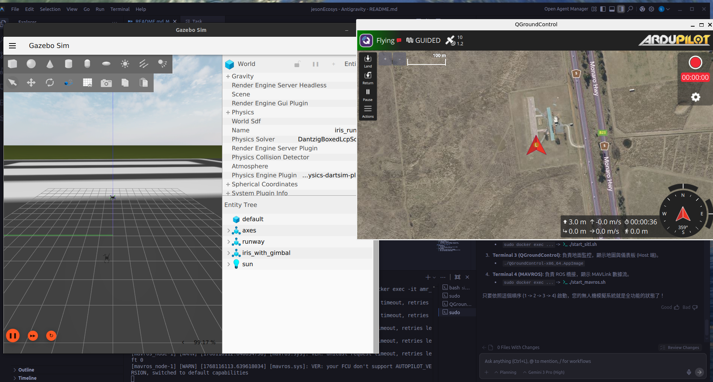

# 台灣 AMR/UGV 實戰開發計畫 (Jetson Orin Nano 版)

這份計畫是針對您目前的硬體選擇（Jetson Orin Nano）與專注於無人車（UGV）方向所量身打造的。

## 0. 硬體選擇 FAQ 與建議

### Q1: Jetson Orin Nano 8GB (美規 $8000 NTD) 值得買嗎？
**絕對值得！**
*   **價格優勢**：台灣代理商的 Developer Kit 通常售價在 $15,000~$18,000 台幣左右。如果您能以 $8,000 取得（假設包含載板/Carrier Board），這是一個非常划算的投資。
*   **效能優勢**：Orin Nano 提供高達 40 TOPS 的 AI 算力，是上一代 Nano 的數十倍，能夠流暢運行現代的 DNN 模型與 VSLAM 算法。

### Q2: 儲存裝置建議 (SSD vs SD Card)
**強烈建議使用 NVMe SSD 作為系統碟。**
*   **M.2 NVMe SSD (推薦)**：
    *   Orin Nano 支援 PCIe Gen3 x4 NVMe。
    *   **推薦型號**：Samsung 980 500GB/1TB, Kingston NV2, WD Blue SN580。
    *   **理由**：任何 Gen3 或 Gen4 的 NVMe SSD 速度都遠勝 SD 卡。這對於操作系統流暢度、編譯程式碼 (Build) 以及載入大型 AI 模型至關重要。
*   **microSD**：
    *   **資料紀錄 (Data Logging)** 或 **系統備份**。但如果是要跑 ROS 2 和 Ubuntu 桌面，NVMe SSD 帶來的體驗提升是巨大的。

### Q3: 純視覺 SLAM (Visual SLAM) 比 Lidar + Cam 難嗎？
**是的，純視覺 SLAM 的技術門檻與環境要求都較高。**

| 特性 | Lidar SLAM (雷達) | Visual SLAM (視覺) |
| :--- | :--- | :--- |
| **基本原理** | 發射雷射光測距 (ToF/三角測距) | 透過影像特徵點追蹤與配對 |
| **環境依賴** | **低**。全黑環境、白牆皆可運作。 | **高**。需要光線、紋理 (Texture)。白牆或玻璃會失效。 |
| **運算需求** | 低 (2D Lidar)。CPU 輕鬆跑。 | 高。需要 GPU 加速 (Orin 很適合)。 |
| **入門難度** | **容易**。數據直觀，容易除錯。 | **困難**。初始化失敗、失去追蹤 (Lost) 的原因較難排查。 |

**結論**：建議以 **Lidar 為主 (保底)**，**Vision 為輔 (進階)**。
這樣您可以先確保車子能動、能避障 (靠 Lidar)，行有餘力再開啟 Visual SLAM 做融合定位，這是最穩健的學習路徑。

---

## 1. 硬體採購詳單 (Hardware Bill of Materials)

*預算為新台幣 (NTD) 預估值*

| 類別 | 項目 | 規格建議 | 預估費用 | 關鍵說明 |
| :--- | :--- | :--- | :--- | :--- |
| **核心大腦** | **Jetson Orin Nano 8GB** | Developer Kit (含載板/風扇) | ~$8,000 | 務必確認是否為完整開發套件。 |
| **系統碟** | **NVMe SSD** | 500GB 或 1TB (M.2 2280) | $1,500 | Samsung 980, WD SN580, Kingston NV2。 |
| **無線網卡** | **Wi-Fi / BT 模組** | M.2 Key E (Intel AX210 / 8265) | $500 - $800 | Orin Nano 通常需要另外加裝或確認是否內建。 |
| **微控制器** | **Pixhawk 4 Mini / 6C** | 飛控板 + GPS + Power Module | $5,000 | 負責即時控制 (Real-time Control)。 |
| **雷達** | **Lidar** | LD19 / RPLidar A1 / Unitree L1 | $3,000 | LD19 性價比高，適合入門與一般室內導航。 |
| **鏡頭** | **Camera** | IMX219 (CSI) 或 USB Webcam | $800 | CSI 介面延遲低，適合 VSLAM；USB 方便測試。 |
| **底盤** | **UGV Chassis** | 帶編碼器 (Encoder) 馬達的車架 | $3,500 | **編碼器是必須的**，否則無法計算里程 (Odometry)。 |
| **電源** | **電池 & 轉換** | 3S LiPo (11.1V) + DC-DC 降壓 | $2,000 | 需將電池電壓穩壓給 Orin (12V-19V) 與 Hub。 |
| **雜項** | 線材/Hub/螺絲 | 杜邦線, XT60, USB Hub | $1,000 | 預留一點除錯用的耗材預算。 |

---

## 2. 軟體效能評估 (Orin Nano 8GB)

在 Jetson Orin Nano 8GB 運行 **Ubuntu 22.04 (JetPack 6)** 與 **ROS 2 Humble** 的預期表現：

1.  **基礎負載 (OS + ROS Core)**:
    *   CPU: < 5%
    *   RAM: ~1.5 GB
    *   狀態: 極度流暢。

2.  **導航模式 (Nav2 + Slam_toolbox + Lidar)**:
    *   CPU: 15-25%
    *   RAM: +1 GB
    *   狀態: **輕鬆勝任**。這是 AMR 的基本功，Orin Nano 處理起來游刃有餘。

3.  **AI 辨識模式 (YOLOv8s + TensorRT)**:
    *   FPS: 30-60 FPS (視模型大小與圖像解析度而定)
    *   GPU: 50-80% 利用率
    *   狀態: **高效**。Orin 的強項，比樹莓派強大太多的地方。

4.  **視覺 SLAM (Isaac ROS Visual SLAM)**:
    *   FPS: 30 FPS+
    *   RAM: 顯著增加 (可能佔用 2-3GB)
    *   狀態: **可行**。Orin Nano 有專門的 VPI (Vision Programming Interface) 硬體加速，跑 VSLAM 是順暢的，但要注意記憶體管理。

**綜合評估**：
8GB 記憶體對於同時跑「導航」+「視覺 SLAM」+「大型語言模型(LLM)」會比較吃緊。
**建議務必設定 8GB-16GB 的 NVMe Swap (虛擬記憶體)**，可以避免程式因為 OOM (Out of Memory) 崩潰。

---

## 2.5 開發策略：模擬優先 (Simulation First)
**核心理念**：在 PC (Ubuntu 22.04) 利用 Docker + Gazebo 進行開發，驗證無誤後才部署至 Jetson Orin Nano。
*   **SITL (Software In The Loop)**：利用 ArduPilot SITL 在電腦上模擬真實飛控行為。
*   **Containerization**：使用 Docker 隔離 ROS 2 Humble 與模擬環境，確保開發環境純淨且可移植。
*   **Offboard Control Focus**：優先專注於 Mavros/DDS 通訊與 Nav2 導航邏輯，而非硬體除錯。

---

## 3. 八週實戰執行計畫 (UGV Focus)

### Phase 0: PC 模擬環境搭建 (Week 1 - PC Host)
*   **目標**：在個人電腦上建立完整的 drone 模擬開發環境。
*   **執行項目**：
    *   建立 `simulation` Docker 環境 (ROS 2 Humble + ArduCopter + Gazebo)。
    *   驗證 ArduCopter SITL 起飛與降落。
    *   測試 Mavros/Micro-ROS 通訊是否正常 (能讀取 Pose, 發送 Velocity)。
    *   **產出**：一個可一鍵啟動的 `docker-compose.yml` 與驗證過的 SITL 環境。

### Phase 0 執行紀錄 (Execution Log)
*   **[2026-01-10] 環境建置初始化**:
    *   建立 `simulation/` 目錄。
    *   **Dockerfile**: 基於 `osrf/ros:humble-desktop-full`，整合 Gazebo Garden 與 ArduPilot Plugin。
    *   **Docker Compose**: 設定 Host Network 與 X11 Forwarding，支援圖形化介面顯示 ArduPilot SITL 與 Gazebo。
    *   **下一步**: 需要下載 ArduPilot 原始碼 (因檔案過大不直接包入 Image，建議掛載或在 Container 內 Clone) 並編譯 SITL。

### Phase 0 架構分析與專業方向 (Architecture & Direction)
**目前 `docker-compose build` 正在建構的，是一個標準化的「微服務模擬架構」。**

#### 1. 為什麼這樣做？ (The "Why")
*   **Infrastructure as Code (IaC)**: 我們用 `Dockerfile` 定義了開發環境。這意味著無論您換哪台電腦 (只要是 Linux)，只要 `docker-compose up`，就能得到一模一樣的開發環境。
*   **Bridge Pattern (橋接模式)**: 我們正在編譯兩個關鍵的「橋樑」：
    *   **Physics Bridge (`ardupilot_gazebo`)**: 讓 Gazebo (模擬物理、重力、碰撞) 與 ArduPilot (模擬飛控演算法) 溝通。
    *   **Comms Bridge (`mavros`)**: 讓 ROS 2 (高層決策) 能透過 MAVLink 協議指揮 ArduPilot (底層控制)。


#### 3. 未來擴充方向 (Roadmap)
*   **多機協同**: 透過 Docker 的 `network_mode`，我們可以輕易複製多個 Container 來模擬多台無人機編隊。
*   **CI/CD**: 這套環境未來可以直接放上 GitHub Actions，讓您的程式碼每次 Push 都自動跑一次模擬飛行測試。

### Phase 0 完成報告：環境能力與開發指南 (Environment Capabilities)
**恭喜！您的 Docker 環境 (`jeson_ecosys/simulation:latest`) 已經俱備以下強大能力：**

#### 1. 軟體與工具包 (Installed Packages)
*   **ROS 2 Humble Desktop Full**: 包含完整的機器人作業系統、Rviz2 (視覺化)、Nav2 (導航堆棧) 依賴。
*   **Gazebo Harmonic (LTS)**: 最新一代的開源模擬器，支援高擬真物理引擎與感測器模擬 (Lidar, Camera, IMU)。
*   **ArduPilot Ecosystem**:
    *   **Gazebo Plugin**: 實現了 ArduPilot (SITL) 與 Gazebo 的物理連接。
    *   **MAVROS**: 作為 ROS 2 與飛控之間的溝通橋樑 (MAVLink <-> ROS Topics)。
*   **Multimedia (GStreamer)**: 完整支援 `plugins-good/bad/ugly`，這意味著您可以在模擬器中架設虛擬攝影機，並透過 RTSP 或 UDP 串流影像給 OpenCV 或 Web 介面。

#### 2. 您現在可以做哪些開發測試？ (Development Roadmap)

每個測試都可以自由選擇 **無人機 (Copter)** 或 **無人車 (Rover)**。
由於您的專案目標是 AMR，建議優先熟悉 **ArduRover**。

### 4. 啟動流程 (Standard Operating Procedure)

為了確保每次都能順利啟動，請遵循以下標準步驟。

#### 步驟 1: 啟動環境 (Terminal 1 - 物理/Gazebo)
```bash
# 1. 啟動 Container 並進入 (Host 端執行)
cd simulation
./run_sim.sh

# 2. 啟動 Gazebo (Container 內執行)
# 注意：第一次啟動可能需要幾秒鐘載入模型
gz sim -v4 -r iris_runway.sdf
```
*(請保持此視窗開啟，等待跑道與無人機出現)*

#### 步驟 2: 啟動飛控 (Terminal 2 - 大腦/ArduPilot)
開啟一個 **新的終端機 (New Terminal)**：
```bash
# 1. 進入容器
sudo docker exec -it amr_sim bash

# 2. 啟動 SITL
./start_sitl.sh
```
*(此視窗會顯示 MAVProxy 控制台，您可以在此輸入 param set 或 mode 指令)*

#### 步驟 3: 啟動 QGroundControl (Terminal 3 - 地面站)
開啟一個 **新的終端機 (New Terminal - Host 端)**：
```bash
cd simulation
# 確保您已經下載並賦予權限 (參見上方 Phase 0.5)
./QGroundControl-x86_64.AppImage
```
*(QGC 應會自動連線。若無反應請檢查是否與 SITL 在同一網段)*

#### 步驟 4: 啟動 ROS 橋接 (Terminal 4 - MAVROS)
開啟一個 **新的終端機 (New Terminal)**：
```bash
# 1. 進入容器
sudo docker exec -it amr_sim bash

# 2. 啟動 MAVROS
./start_mavros.sh
```
*(看到 CON: Got HEARTBEAT 代表 ROS 2 已成功連接飛控)*

#### 步驟 5: 起飛驗證
在 QGC 點擊 "Takeoff" 或在 Terminal 2 (MAVProxy) 輸入：
```bash
MAV> mode GUIDED
MAV> arm throttle
MAV> takeoff 10
```



---

### 5. 踩坑紀錄與解決方案 (Troubleshooting Log)

以下記錄建置過程中遇到關鍵問題與解決方法：

| 問題 (Issue) | 症狀 (Symptom) | 原因 (Cause) | 解決方案 (Solution) |
| :--- | :--- | :--- | :--- |
| **Protocol Magic Error** | `Bad Protocol Magic 0`, `Link 1 down` | ArduPilot 預設二進位格式不相容於新版插件。 | 啟動時必須加上 `-f JSON` 參數 (已包含在 `start_sitl.sh`)。 |
| **GPU 權限不足** | `libEGL warning: failed to open /dev/dri/renderD128` | Docker 內使用者無權存取宿主機顯卡。 | `sudo chmod 666 /dev/dri/renderD128`。 |
| **Frame Class Error** | `PreArm: Motors: Check frame class and type` | JSON 模式未載入特定機型預設值。 | 手動設定 `FRAME_CLASS 1` (Quad) 與 `FRAME_TYPE 1` (X)。 |
| **重啟後斷線** | `reboot` 後 `connection refused` | SITL 程序重啟導致網路斷開。 | 手動重啟腳本即可。 |

在這個模擬環境中，可以進行「**由淺入深**」的四階段測試：

1.  **Level 1: 基礎控制與指令 (Basic Command)**
    *   **無人機**: 輸入 `mode GUIDED`, `arm throttle`, `takeoff 10` (起飛)。
    *   **無人車**: 輸入 `mode MANUAL`, `arm throttle`, `rc 3 1600` (前進)。
    *   **驗證目標**: 確認載具在 Gazebo 中產生對應動作，證明物理引擎與飛控運作正常。

2.  **Level 2: ROS 2 通訊驗證 (Offboard Control)**
    *   **測試項目**: 撰寫一個 Python script (ROS 2 Node)，發送 `/mavros/setpoint_velocity/cmd_vel` 指令。
    *   **驗證目標**: 用程式碼控制無人機畫圓或走正方形。這是開發自動巡航 (Mission Planning) 的基礎。

3.  **Level 3: 視覺整合 (Vision Integration)**
    *   **測試項目**: 在 Gazebo 模型上掛載虛擬相機，並在 ROS 2 中訂閱影像 Topic。
    *   **驗證目標**: 確認能看到即時畫面，並測試 OpenCV 影像處理 (例如：顏色追蹤、ArUco Marker 降落)。

4.  **Level 4: 導航與避障 (Sim-to-Real)**
    *   **測試項目**: 加入虛擬 Lidar，啟動 `slam_toolbox` 建圖與 `nav2` 導航。
    *   **驗證目標**: 這是最終目標。如果能在模擬器中實現「點擊地圖自動避障導航」，那麼部署到真機 (Jetson Nano) 上通常只需要微調參數即可。

**下一步行動建議 (Next Action)**
*   運行 `./run_sim.sh` (或 `docker-compose up`) 啟動環境。
*   如果是第一次運行，需要在 Container 內執行 `sim_vehicle.py` 下載 ArduPilot 參數。

### Phase 1: 硬體基礎建設 (Week 2)
*   **W1 採購與組裝**: 確認清單，購買硬體。組裝車體底盤，焊接電源線。
*   **W2 環境架設**: 
    *   安裝 NVMe SSD。
    *   刷寫 JetPack 6 (Ubuntu 22.04)。
    *   設定網路 (SSH, Wi-Fi)。
    *   安裝 Docker 與 ROS 2 Humble 環境。

### Phase 2: 控制與感知 (Week 3-4)
*   **W3 底層控制**:
    *   Pixhawk 韌體設定 (ArduRover)。
    *   PID 參數調校（讓車子走直線，轉彎準確）。
    *   Jetson 與 Pixhawk 通訊 (Mavros/Micro-ROS)。
*   **W4 感測器驅動**:
    *   啟動 Lidar (LD19)。
    *   設定 TF (座標轉換樹)：定義雷達與車子中心的相對位置。
    *   在 Rviz 中看到車子與雷達掃描點同步移動。

### Phase 3: 定位與導航 (Week 5-6)
*   **W5 建圖 (SLAM)**:
    *   使用 `slam_toolbox` 進行 2D 建圖。
    *   遙控車子把家裡跑一圈，建立完整地圖並儲存。
*   **W6 自動導航 (Nav2)**:
    *   設定代價地圖 (Costmap)。
    *   調校路徑規劃器 (Planner) 與控制器 (Controller)。
    *   達成「點擊地圖任意點，車子自動避障前往」的里程碑。

### Phase 4: AI 加值應用 (Week 7-8)
*   **W7 視覺賦能**:
    *   啟動 Camera。
    *   部署 Isaac ROS YOLO (物件偵測) 或 Visual SLAM。
    *   驗證純視覺定位與雷達定位的差異。
*   **W8 專案整合**:
    *   撰寫 Python 利用 Nav2 API 發送導航指令。
    *   結合 AI 判斷（例如：看到人就停下來，或跟隨特定物體）。
    *   錄製 Demo 影片，整理 GitHub 文件。
